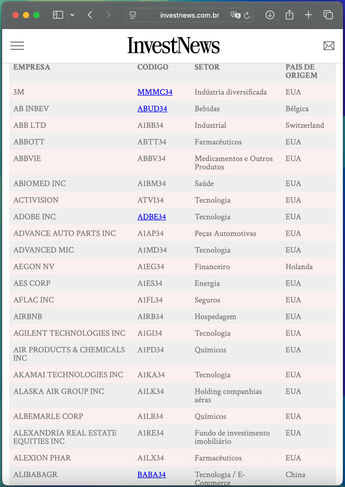
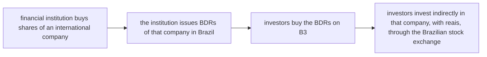
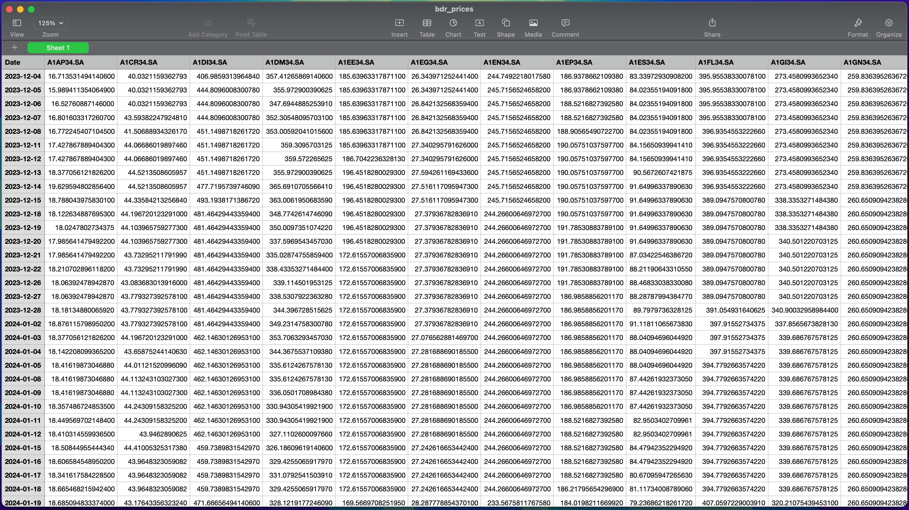

# Extracting tickers from all BDRs using web scraping
Extract an updated list of all BDR tickers traded in Brazil available to individuals on B3

</br>

## About Data
- Web scraping of the list of BDRs available on the site [investnews.com.br](https://investnews.com.br)


</br>

## About Metrics
- BDRs are "replicas" of shares in foreign companies, traded on the Brazilian stock exchange (B3)
- They allow Brazilian investors to invest in foreign companies without having to open an account outside the country, facilitating the international diversification of the investment portfolio



> [!WARNING]
> When you buy BDRs, you are not buying the share directly, but rather a certificate that represents it

</br>

## Data Preparation
- Removal of data with missing values ​​and Preparation for analysis
- Use of the yfinance library to obtain the closing prices of BDRs

</br>

## Deployment
- Creation of a DataFrame with tickers and related information
- Exporting data in `.csv` format to the `../output/bdr_prices.csv` directory


## How to Run
```bash
git clone https://github.com/pmusachio/bdr-tickers-using-web-scraping.git
```

```bash
cd enter-your-download-path/bdr-tickers-using-web-scraping
```

```bash
python -m venv venv
source venv/bin/activate
```

```bash
pip install -r requirements.txt
```

- Run the `bdr_scraping.ipynb` notebook in a compatible environment
- Data will be downloaded and processed automatically
- `.csv` file with BDR prices will be saved in `../output/bdr_prices.csv`

</br>

## Get in touch
[](mailto:paulomusachio@gmail.com) </br>
[](https://www.linkedin.com/in/pmusachio/)
