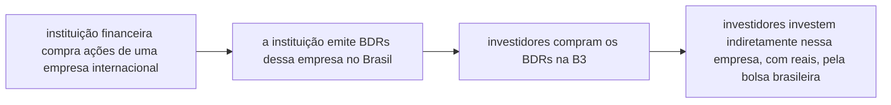

# Extracting tickers from all BDRs using web scraping
Este projeto visa extrair os tickers de todos os BDRs (Brazilian Depositary Receipts) negociados no Brasil utilizando técnicas de web scraping.
- Objetivo: Obter uma lista atualizada de todos os tickers de BDRs negociados no Brasil.
- Importância: Facilitar análises e comparações de BDRs para investidores e analistas.

</br>

## About Data
### [investnews.com.br](https://investnews.com.br)

- Fonte: Site da B3 (Bolsa de Valores brasileira).
- Tipo de dados: HTML da página contendo a lista de BDRs.


</br>

## About Metrics
- BDRs são "réplicas" de ações de empresas estrangeiras, negociadas na bolsa brasileira (B3)
- Permitem que investidores brasileiros invistam em empresas estrangeiras sem precisar abrir conta fora do país, facilitando a diversificação internacional da carteira de investimentos



> [!WARNING]
> Ao comprar um BDR, você não está comprando a ação diretamente, mas sim um certificado que representa ela

</br>

## Data Preparation
- Utilização de bibliotecas como BeautifulSoup para parsing do HTML
- Extração das informações relevantes (tickers, nomes das empresas)

</br>

## Modeling
- Desenvolvimento de um script Python para automatizar o processo de scraping.
- Implementação de funções para limpar e estruturar os dados extraídos.

</br>

## Evaluation
- Verificação da integridade e completude dos dados extraídos.
- Comparação com outras fontes para garantir a precisão da informação.

</br>

## Deployment
- Criação de um DataFrame Pandas com os tickers e informações relacionadas.
- Possibilidade de exportar os dados para CSV ou integrar com outras análises.

## How to Run
```bash
git clone https://github.com/pmusachio/bdr-tickers-using-web-scraping.git

cd enterYourDownloadPath/bdr-tickers-using-web-scraping

python -m venv venv
source venv/bin/activate

pip install -r requirements.txt
```

</br>

## Get in touch
[](mailto:paulomusachio@gmail.com) </br>
[](https://www.linkedin.com/in/pmusachio/)

</br>

## Próximos Passos
- Automatizar a extração periódica para manter os dados atualizados.
- Integrar com análises de desempenho e comparações com ações originais.
